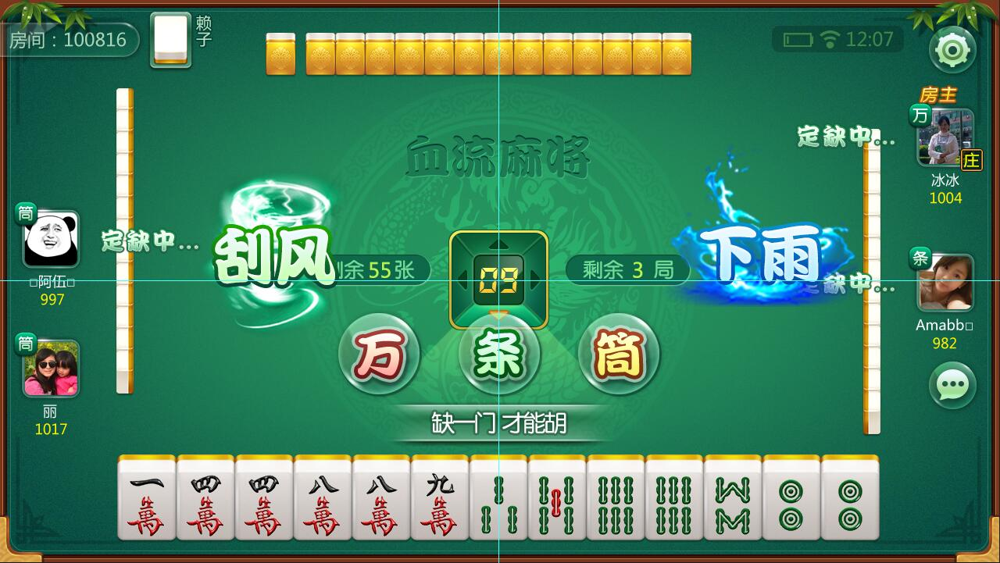
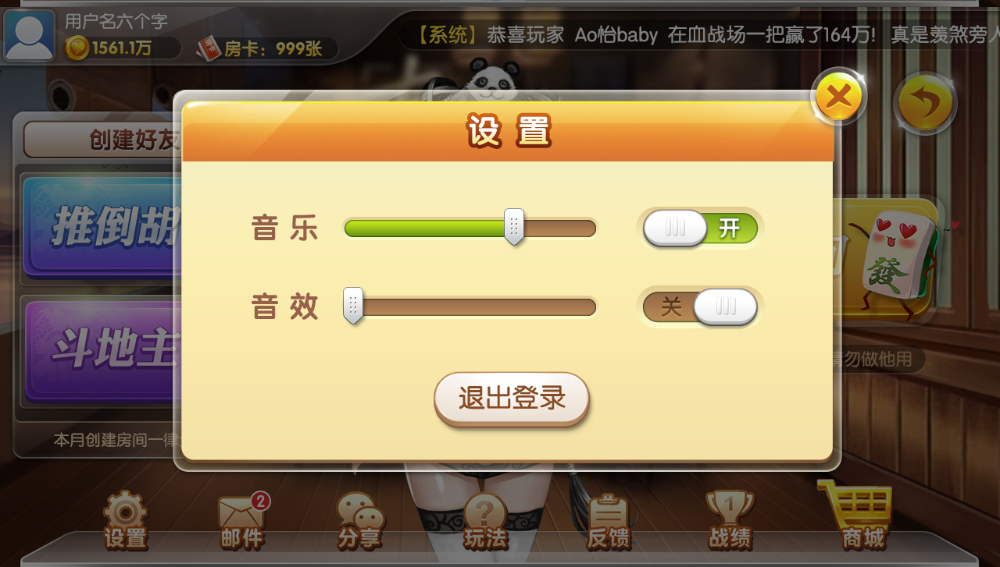

使用FairyUI构建UI界面

##### [FairyUI在线演示](http://www.fairygui.com/demo)
##### [FairyUI社区](http://www.fairygui.com/questions)
##### [FairyUI免费视频教程](http://www.taikr.com/my/course/446)
##### [FairyUI文字教程](http://www.fairygui.com/tutorial)

# 项目预览

      
